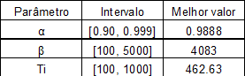
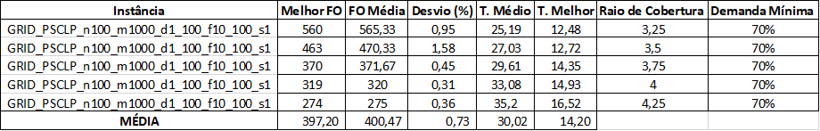
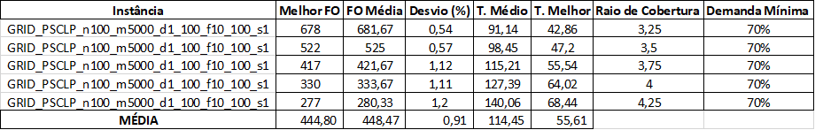
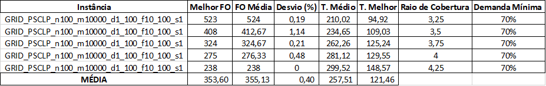
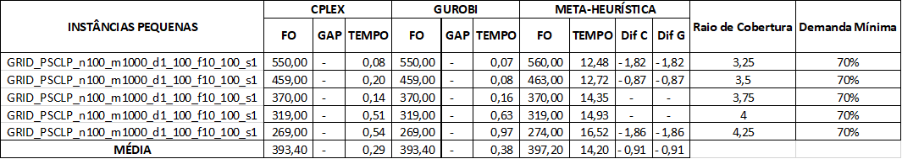
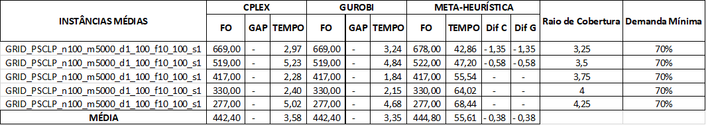
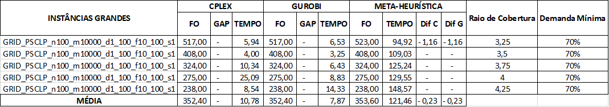

# 📍 Problema de Localização com Cobertura Parcial (PLCP)


Este projeto implementa soluções para o Problema de Localização com Cobertura Parcial (PLCP) utilizando métodos exatos (**CPLEX e Gurobi**) e uma **Meta-heurística (Simulated Annealing)**.

## 📋 Descrição do Problema

O PLCP é um problema de otimização onde o objetivo é minimizar o custo de instalação de facilidades, garantindo que uma demanda mínima seja coberta dentro de um raio de cobertura específico.

### 🧮 Formulação
- **Variáveis de decisão:**
  - `y[i]`: 1 se a facilidade i é instalada, 0 caso contrário
  - `z[j]`: 1 se o cliente j é coberto, 0 caso contrário

- **Função objetivo:** Minimizar o custo total de instalação das facilidades
- **Restrições:**
  - Cobertura: Um cliente só pode ser coberto se houver pelo menos uma facilidade instalada dentro do raio de cobertura
  - Demanda mínima: A demanda total coberta deve ser pelo menos 70% da demanda total

## 📁 Estrutura do Projeto

```
├── assets/                  # Imagens das tabelas de resultados
├── instances/               # Instâncias de teste no formato .dat
├── irace_tuning/            # Logs e configurações do iRace
├── Resultado_Parte1/        # Resultados dos experimentos(Parte 1)
│   ├── models/              # Modelos exportados (.lp)
│   ├── solutions/           # Soluções encontradas (.txt)
│   ├── Tabelas-Final.xlsx   # Planilha com tabelas com os resultados organizados
├── Resultado_Parte2/        # Resultados dos experimentos(Parte 2)
│   ├── solutions/           # Soluções encontradas (.txt)
│   ├── Tabela1.xlsx         # Planilha com a tabela de calibração de parâmetros via iRace
│   ├── Tabela2.xlsx         # Planilha com tabelas com os resultados obtidos pelo método heurístico
│   ├── Tabela3.xlsx         # Planilha com tabelas com a comparação dos resultado
├── Solvers/                 # Código Fonte
│   ├── solver_sa.py         # Simulated Annealing 
│   ├── solver_cplex.py      # Solver CPLEX
│   ├── solver_gurobi.py     # Solver Gurobi
│   └── utils.py             # Utilitários
├── .gitignore               # Arquivos ignorados pelo Git
├── main_Parte1.py           # Script principal para a parte 1(Gurobi e CPLEX)
├── main_Parte2.py           # Script principal para a parte 2(Simulated Annealing)
├── parser_plcp.py           # Parser para instâncias .dat
├── README.md                # Documentação do projeto
├── requirements.txt         # Dependências do projeto
```

## ⚙️ Instalação

1. Clone o repositório:
```bash
git clone https://github.com/Layonj3000/Problema-de-Localizacao-com-Cobertura-Parcial.git
cd Problema-de-Localizacao-com-Cobertura-Parcial
```

2. Crie um ambiente virtual:
```bash
python -m venv plcp_env
plcp_env\Scripts\activate  # Windows
# ou
source plcp_env/bin/activate  # Linux/Mac
```

3. Instale as dependências:
```bash
pip install -r requirements.txt
```

## 🚀 Uso

### 🔄 Execução Completa com Gurobi e CPLEX
Para executar todas as instâncias com ambos os solvers(Gurobi e CPLEX):

```bash
python main_Parte1.py 
```

### ⚡ Parâmetros Opcionais
```bash
python main_Parte1.py --inst_dir instances --out_dir results --time_limit 3600
```

- `--inst_dir`: Diretório das instâncias (padrão: "instances")
- `--out_dir`: Diretório de saída (padrão: "results")
- `--time_limit`: Tempo limite em segundos (padrão: 3600)

### 🔄 Execução Completa com Simulated Annealing
Para executar todas as instâncias com Meta-heurística (Simulated Annealing):

```bash
python main_Parte2.py 
```

## 🔬 Configuração dos Experimentos

- **Raios de cobertura testados:** 3.25, 3.5, 3.75, 4,4.25
- **Percentual de demanda mínima:** 70%
- **Tempo limite:** 1 hora por instância(CPLEX e Gurobi) e 5 minutos por instância(Simulated Annealing)

## 📄 Formato das Instâncias

As instâncias seguem o formato:
```
<n_facilities> <n_clients>
F <id> <x> <y> <cost>
C <id> <x> <y> <demand>
```

## 📊 Resultados CPLEX e Gurobi.

Os resultados são salvos em:
- **results.xlsx**: Planilha consolidada com LB, UB, GAP e tempo para cada configuração
- **solutions/**: Arquivos de texto com as soluções (facilidades instaladas e clientes cobertos)
- **models/**: Modelos exportados em formato .lp

## 📈 Tabelas de Resultados

### Instâncias Pequenas


### Instâncias Médias


### Instâncias Grandes


## 🧬 Resultados da Meta-heurística e Calibração (iRace)

Foi implementada a meta-heurística **Simulated Annealing (SA)**.

### Calibração de Parâmetros
Para garantir o melhor desempenho, os parâmetros do algoritmo foram calibrados utilizando o pacote **iRace** (Iterated Racing for Automatic Algorithm Configuration).

Foram utilizadas **3 instâncias de calibração** (1 pequena, 1 média e 1 grande) para definir os melhores valores, conforme apresentado abaixo:

#### Tabela 1 – Calibração de parâmetros via iRace


---

## 📊 Metodologia Experimental

Os experimentos foram conduzidos seguindo as regras:
1.  **Execuções:** A meta-heurística foi executada **3 vezes** para cada instância com sementes aleatórias distintas.
2.  **Tempo Limite:** 5 minutos (300 segundos) por execução.
3.  **Comparação:** Os resultados foram confrontados com os ótimos globais obtidos pelo CPLEX/Gurobi.

### Resultados da Meta-heurística
A tabela abaixo apresenta o desempenho estatístico do Simulated Annealing.

### Tabela 2 – Resultados obtidos pelo método heurístico

### Instâncias Pequenas


### Instâncias Médias


### Instâncias Grandes


**Legenda das Métricas:**
* **Melhor FO:** A melhor Função Objetivo obtida nas 3 execuções.
* **FO Média:** Média aritmética das 3 FOs.
* **Desvio (%):** $\frac{|FO_{Media} - FO_{Melhor}|}{FO_{Melhor}} \times 100$
* **Tempo Médio:** Média do tempo total de execução.
* **T. Melhor:** Média do tempo em que a melhor solução foi encontrada durante a busca.

---

### Comparativo: Exatos vs. Heurística
Esta tabela compara a qualidade da solução e o tempo computacional entre os solvers comerciais e a meta-heurística desenvolvida.

### Tabela 3 – Comparação dos resultados

### Instâncias Pequenas


### Instâncias Médias


### Instâncias Grandes


**Cálculo das Diferenças (Gap em relação ao Solver):**
$$Dif\_X = \frac{(FO\_X - FO\_MH)}{FO\_X} \times 100$$
*Onde $X$ representa o solver (CPLEX ou GUROBI).*

---
## 📦 Dependências

- Python=3.10
- numpy>=1.26
- pandas>=2.1
- docplex>=2.25.236 (CPLEX)
- gurobipy>=11.0.0 (Gurobi)
- openpyxl>=3.1

## 📜 Licenças dos Solvers

- **CPLEX**: Requer licença IBM (acadêmica disponível)
- **Gurobi**: Requer licença Gurobi (acadêmica disponível)

## 👨‍💻 Autor

<div align="center">
  <table>
    <tr>
      <td align="center"><a href="https://github.com/Layonj300"><br><sub>Layon Reis</sub></a></td>
    </tr>
  </table>
</div>
