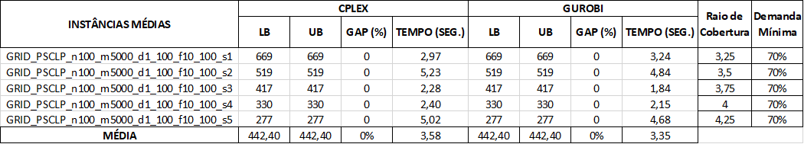
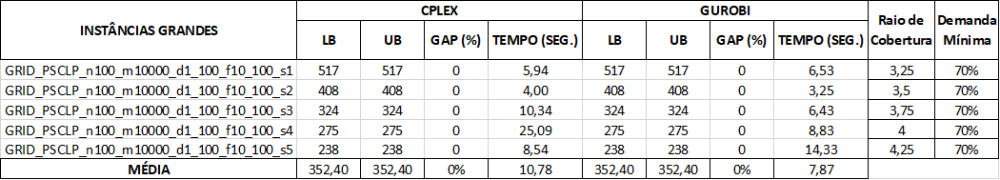
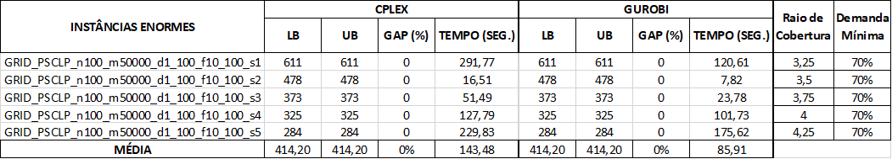

# 📍 Problema de Localização com Cobertura Parcial (PLCP)

Este projeto implementa soluções para o Problema de Localização com Cobertura Parcial usando os solvers CPLEX e Gurobi.

## 📋 Descrição do Problema

O PLCP é um problema de otimização onde o objetivo é minimizar o custo de instalação de facilidades, garantindo que uma demanda mínima seja coberta dentro de um raio de cobertura específico.

### 🧮 Formulação
- **Variáveis de decisão:**
  - `y[i]`: 1 se a facilidade i é instalada, 0 caso contrário
  - `z[j]`: 1 se o cliente j é coberto, 0 caso contrário

- **Função objetivo:** Minimizar o custo total de instalação das facilidades
- **Restrições:**
  - Cobertura: Um cliente só pode ser coberto se houver pelo menos uma facilidade instalada dentro do raio de cobertura
  - Demanda mínima: A demanda total coberta deve ser pelo menos 50% da demanda total

## 📁 Estrutura do Projeto

```
├── assets/            # Imagens das tabelas de resultados
├── instances/         # Instâncias de teste no formato .dat
├── plcp_env/          # Ambiente virtual Python
├── results/           # Resultados dos experimentos
│   ├── models/        # Modelos exportados (.lp)
│   ├── solutions/     # Soluções encontradas (.txt)
│   └── results.xlsx   # Planilha com resultados consolidados
├── .gitignore         # Arquivos ignorados pelo Git
├── main.py            # Script principal
├── parser_plcp.py     # Parser para instâncias .dat
├── README.md          # Documentação do projeto
├── requirements.txt   # Dependências do projeto
├── solver_cplex.py    # Implementação com CPLEX
├── solver_gurobi.py   # Implementação com Gurobi
├── Tabelas.xlsx       # Planilha com tabelas com os resultados organizados
└── utils.py           # Utilitários para salvar resultados
```

## ⚙️ Instalação

1. Clone o repositório:
```bash
git clone <https://github.com/Layonj3000/Problema-de-Localizacao-com-Cobertura-Parcial.git>
cd Problema-de-Localizacao-com-Cobertura-Parcial
```

2. Crie um ambiente virtual:
```bash
python -m venv plcp_env
plcp_env\Scripts\activate  # Windows
# ou
source plcp_env/bin/activate  # Linux/Mac
```

3. Instale as dependências:
```bash
pip install -r requirements.txt
```

## 🚀 Uso

### 🔄 Execução Completa
Para executar todas as instâncias com ambos os solvers:

```bash
python main.py
```

### ⚡ Parâmetros Opcionais
```bash
python main.py --inst_dir instances --out_dir results --time_limit 3600
```

- `--inst_dir`: Diretório das instâncias (padrão: "instances")
- `--out_dir`: Diretório de saída (padrão: "results")
- `--time_limit`: Tempo limite em segundos (padrão: 3600)

## 🔬 Configuração dos Experimentos

- **Raios de cobertura testados:** 3.25, 3.5, 3.75, 4,4.25
- **Percentual de demanda mínima:** 70%
- **Solvers:** CPLEX e Gurobi
- **Tempo limite:** 1 hora por instância

## 📄 Formato das Instâncias

As instâncias seguem o formato:
```
<n_facilities> <n_clients>
F <id> <x> <y> <cost>
C <id> <x> <y> <demand>
```

## 📊 Resultados

Os resultados são salvos em:
- **results.xlsx**: Planilha consolidada com LB, UB, GAP e tempo para cada configuração
- **solutions/**: Arquivos de texto com as soluções (facilidades instaladas e clientes cobertos)
- **models/**: Modelos exportados em formato .lp

## 📈 Tabelas de Resultados

### Instâncias Pequenas


### Instâncias Médias


### Instâncias Grandes


### Instâncias Enormes


### Instâncias Gigantes


## 📦 Dependências

- Python=3.10
- numpy>=1.26
- pandas>=2.1
- docplex>=2.25.236 (CPLEX)
- gurobipy>=11.0.0 (Gurobi)
- openpyxl>=3.1

## 📜 Licenças dos Solvers

- **CPLEX**: Requer licença IBM (acadêmica disponível)
- **Gurobi**: Requer licença Gurobi (acadêmica disponível)

## 👨‍💻 Autor

<div align="center">
  <table>
    <tr>
      <td align="center"><a href="https://github.com/Layonj300"><br><sub>Layon Reis</sub></a></td>
    </tr>
  </table>
</div>